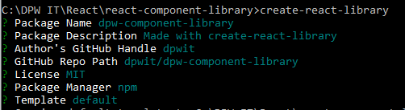
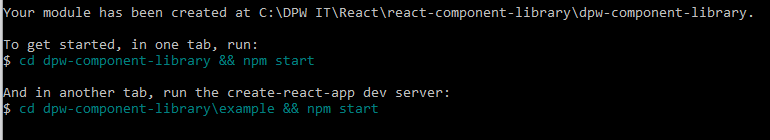

# react-component-library
How to create a React component library

Component libraries are great resources when it comes to developing React-based applications. They allow you to logically group your components in a way that lets others in your team explore them and pick & choose the ones they need.

## create-react-library

When it comes to creating your own components library, this particular package brings a lot of power to your terminal.

With a very simple npm installation, you can obtain a very powerful tool. And once installed, it’ll provide you with a very useful template for creating the entire library.

Some of the key features of this utility

* It integrates Jest for testing
* It supports CSS modules

## Installation

Installing this package is extremely easy if you’re familiar with npm, just type the following in your Terminal:

> `$ npm install -g create-react-library` 

## Using create-react-library

Just like the installation, using this package is very straightforward, all you need is a simple command. Once executed, it’ll ask a few questions and with that information, it’ll create the required template.

> `$ create-react-libary` 

That’s all you need because the actual details about the library you’re looking to create will be provided with the following questions:

Now that new folder, dpw-component-library has been created, you can simply execute the following commands (in different terminals) in order to get the project started:

> ` [Terminal 1] $ cd dpw-compoment-library && npm start`

> `[Terminal 2]$ cd dpw-component-library\example && npm start` 

And you want the project to get started, because it’ll provide you with a web UI for you to test the components.

Just add your components into the `src` folder in order to; create your library and use the `example` folder to showcase them.
